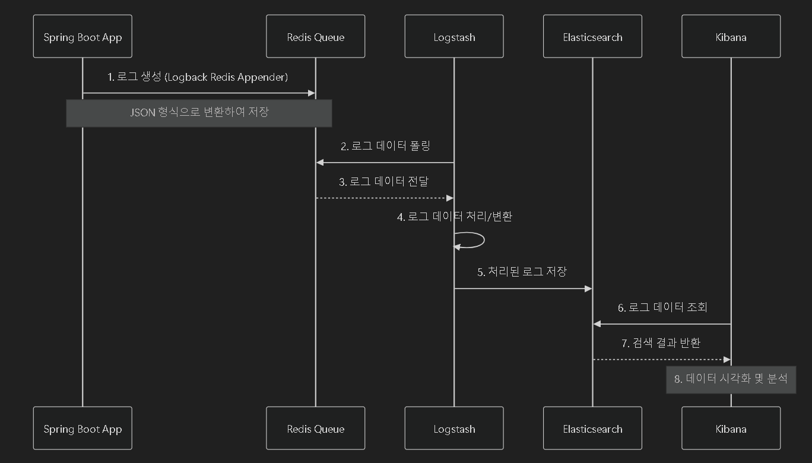

# ELK Stack with Redis Queue Setup Guide

## 아키텍처 개요

### 시스템 시퀀스 다이어그램


### 구조 설명
- **Spring Boot Application**: 애플리케이션에서 생성되는 로그
- **Logback + Redis Appender**: 로그를 Redis 큐로 전송
- **Redis**: 메시지 큐 역할, 로그 데이터 임시 저장
- **Logstash**: Redis에서 로그를 가져와 처리 및 변환
- **Elasticsearch**: 로그 데이터 저장 및 인덱싱
- **Kibana**: 로그 데이터 시각화 및 분석 인터페이스

### 데이터 흐름
1. Spring Boot 애플리케이션에서 로그 발생
2. Logback이 로그를 Redis LIST에 저장 (비동기 처리)
3. Logstash가 Redis에서 로그를 가져와서 처리
4. 처리된 로그는 Elasticsearch에 저장
5. Kibana를 통해 로그 조회 및 분석

## 설치 가이드

### 1. 사전 요구사항
- Docker 및 Docker Compose 설치
- Java 11 이상
- Redis (Docker로 실행)

### 2. 디렉토리 구조 생성
```bash
mkdir elk-stack
cd elk-stack
mkdir -p logstash/config logstash/pipeline
```

### 3. Docker Compose 설정
`docker-compose.yml` 파일 생성:
```yaml
version: '2.2'

services:
  elasticsearch:
    image: docker.elastic.co/elasticsearch/elasticsearch:8.12.0
    container_name: elasticsearch
    environment:
      - discovery.type=single-node
      - xpack.security.enabled=false
      - "ES_JAVA_OPTS=-Xms512m -Xmx512m"
    ulimits:
      memlock:
        soft: -1
        hard: -1
    volumes:
      - elasticsearch-data:/usr/share/elasticsearch/data
    ports:
      - "9200:9200"
    networks:
      - elk-network

  logstash:
    image: docker.elastic.co/logstash/logstash:8.12.0
    container_name: logstash
    volumes:
      - ./logstash/pipeline:/usr/share/logstash/pipeline
      - ./logstash/config/logstash.yml:/usr/share/logstash/config/logstash.yml
    ports:
      - "5044:5044"
      - "5000:5000/tcp"
      - "5000:5000/udp"
      - "9600:9600"
    environment:
      LS_JAVA_OPTS: "-Xmx256m -Xms256m"
    networks:
      - elk-network
    depends_on:
      - elasticsearch

  kibana:
    image: docker.elastic.co/kibana/kibana:8.12.0
    container_name: kibana
    ports:
      - "5601:5601"
    environment:
      - ELASTICSEARCH_HOSTS=http://elasticsearch:9200
    networks:
      - elk-network
    depends_on:
      - elasticsearch

networks:
  elk-network:
    driver: bridge

volumes:
  elasticsearch-data:
```

### 4. Logstash 설정
`logstash/pipeline/logstash.conf` 파일 생성:
```conf
input {
  redis {
    host => "redis"
    port => 6379
    password => "your_redis_password"
    key => "logstash"
    data_type => "list"
    codec => json
  }
}

filter {
  json {
    source => "message"
  }
  date {
    match => ["timestamp", "yyyy-MM-dd HH:mm:ss.SSS"]
    target => "@timestamp"
  }
}

output {
  elasticsearch {
    hosts => ["http://elasticsearch:9200"]
    index => "logstash-%{+YYYY.MM.dd}"
  }
  stdout { codec => rubydebug }
}
```

`logstash/config/logstash.yml` 파일 생성:
```yaml
http.host: "0.0.0.0"
xpack.monitoring.elasticsearch.hosts: ["http://elasticsearch:9200"]
```

### 5. Spring Boot 프로젝트 설정

#### 5.1. 의존성 추가 (build.gradle)
```gradle
implementation 'net.logstash.logback:logstash-logback-encoder:7.4'
implementation 'com.cwbase:logback-redis-appender:1.1.5'
```

#### 5.2. Logback 설정 (src/main/resources/logback.xml)
```xml
<?xml version="1.0" encoding="UTF-8"?>
<configuration>
    <springProperty scope="context" name="SERVER_URL" source="SERVER_URL"/>

    <appender name="CONSOLE" class="ch.qos.logback.core.ConsoleAppender">
        <encoder>
            <pattern>%d{yyyy-MM-dd HH:mm:ss.SSS} [%thread] %-5level %logger{36} - %msg%n</pattern>
        </encoder>
    </appender>

    <appender name="REDIS" class="com.cwbase.logback.RedisAppender">
        <host>${SERVER_URL}</host>
        <port>6379</port>
        <password>${REDIS_PASSWORD}</password>
        <key>logstash</key>
        <type>redis</type>
        <layout class="net.logstash.logback.layout.LogstashLayout">
            <customFields>{"application":"test"}</customFields>
        </layout>
    </appender>

    <appender name="ASYNC_REDIS" class="ch.qos.logback.classic.AsyncAppender">
        <appender-ref ref="REDIS" />
        <queueSize>512</queueSize>
        <discardingThreshold>0</discardingThreshold>
    </appender>

    <root level="INFO">
        <appender-ref ref="CONSOLE" />
        <appender-ref ref="ASYNC_REDIS" />
    </root>

    <logger name="com.example" level="DEBUG" additivity="false">
        <appender-ref ref="CONSOLE" />
        <appender-ref ref="ASYNC_REDIS" />
    </logger>
</configuration>
```

#### 5.3. 애플리케이션 설정 (application.yml)
```yaml
SERVER_URL: redis
REDIS_PASSWORD: your_redis_password
```

### 6. 실행 방법

1. Redis 실행 (이미 실행 중인 경우 스킵)
```bash
docker run -d --name redis -p 6379:6379 redis redis-server --requirepass your_redis_password
```

2. ELK 스택 실행
```bash
docker-compose up -d
```

3. Redis를 ELK 네트워크에 연결
```bash
docker network connect elk-stack_elk-network redis
```

4. Kibana 설정
- http://localhost:5601 접속
- Management → Stack Management → Data Views
- Create data view
    - Name: logstash-*
    - Index pattern: logstash-*
    - Timestamp field: @timestamp
- Save data view

5. Spring Boot 애플리케이션 실행

### 7. 로그 확인
- Kibana에서 Discover 메뉴 선택
- 생성한 Data View 선택
- 시간 범위 설정 후 로그 확인

## 문제 해결

### 일반적인 문제 해결 방법
1. 컨테이너 로그 확인
```bash
docker logs elasticsearch
docker logs logstash
docker logs kibana
```

2. Elasticsearch 상태 확인
```bash
curl http://localhost:9200/_cat/indices?v
```

3. Redis 연결 테스트
```bash
redis-cli -a your_redis_password
PING
```

### 주의사항
- Elasticsearch는 시작하는 데 시간이 걸릴 수 있음
- 메모리 설정은 호스트 시스템 사양에 따라 조정 필요
- 프로덕션 환경에서는 보안 설정 필수

## 참고 자료
- [Elastic 공식 문서](https://www.elastic.co/guide/index.html)
- [Logstash Redis Input Plugin](https://www.elastic.co/guide/en/logstash/current/plugins-inputs-redis.html)
- [Logback Redis Appender](https://github.com/kmtong/logback-redis-appender)